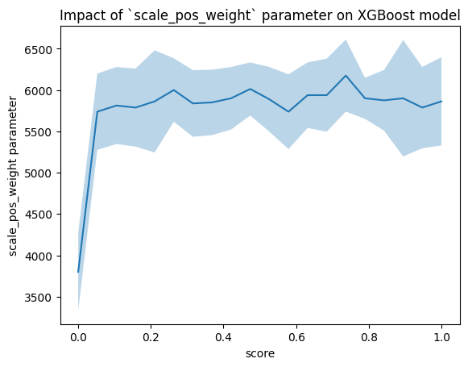

# XGBoost
In this part we tried to use xgboost in our problem. Firstly, we had the idea of tailoring the loss function to our problem, but it turned out that it ain't that easy and could not bring the expected results. Therefore we stayed with the default XGBoost Classifier, only trying to modify its hyperparameters.

### `scale_weight_pos`
We initialy thought that different values of this hyperparamater could bring some changes into model's quality, but unfortunately model's performance seemed to be independent of this parameter.

### Grid search
To evaluate the maximum model's performance, we performed a random grid search of the parameters. The function searched not only for the best set of hyperparameters, but we also treated subset of columns as one of the parameters to be found using grid search.

The initial results of the comparison are on the table below:

| Selection method | best score | score on the validation set |
|-----------------|------------------|----------|
| Boruta          | 6475.0          | 6900    |
| mRMR          | 6787.5          | 6900     |
| NSC           | 4812.5          | 5450     |

