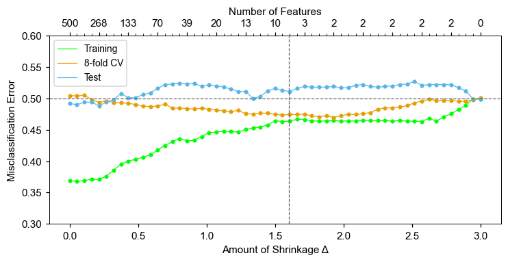
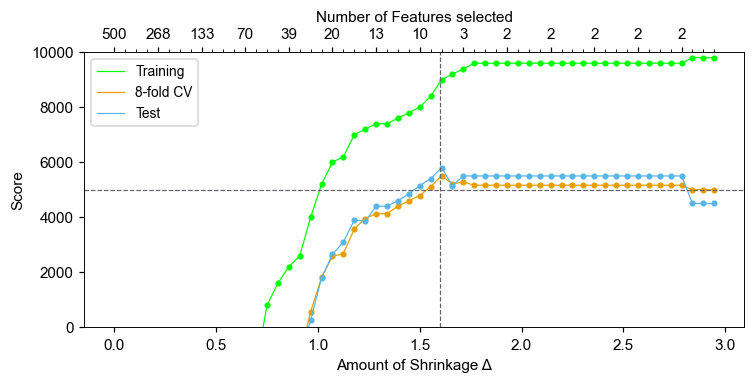

# Nearest Shrunken Centroids 
Using the algorithm described during the lecture and the implementation in python inspired by *the Bible* we tested the nearest shrunken centroids algorithm for our data.

It turned out that the performance of the model is quite poor; it behaves almost comparable to the Dummy Classifier. It looks like the features give some information about the target, but the results are not so promising as the original example in the book.

## Evaluation

Since it the feature selection method, we (clearly) had to choose some features. As in *the Bible* we tried to select the relevant features comparing the model performance and the amount of shrinkage.

But unfortunately, because the model does not predict probabilites, we couldn't use our metric. Therefore we used random forest to evaluate the relevance of selected features.

